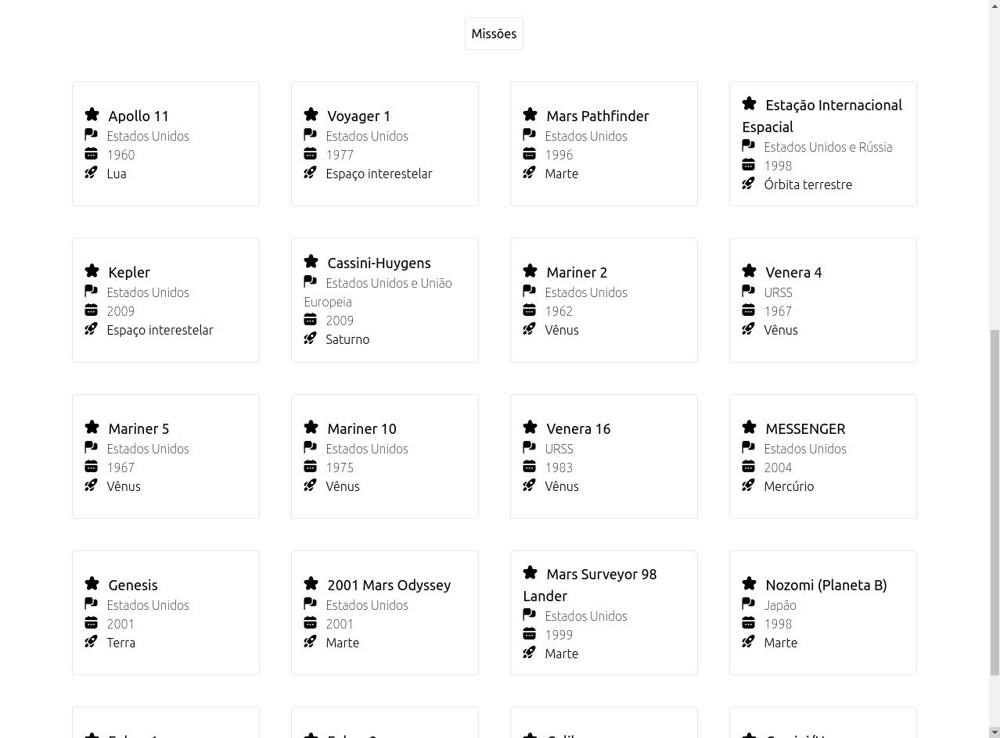

# Solar System

### Projeto desenvolvido JavaScript e ReactJs, estilizado com TailwindCSS + UICONS

## Funcionalidades:
Este projeto, apresenta todos os planetas do nosso sistema solar algumas as missões espaciais realizadas.

## Requisitos do projeto:
  


## Instalação do projeto:

Clonar o projeto:
```bash
  git clone git@github.com:JovemAlex/Solar-System.git
```

Entrar na pasta:
```bash
  cd Solar-System
```

Abrir a pasta atual no editor de texto (VScode):
```bash
  code .
```

Instalar todas as dependências do projeto:
```bash
  npm i
```

Rodar o projeto em seu navegador:
```bash
  npm start
```




_Projeto recebe constates atualizações de estilizações e funcionalidades._